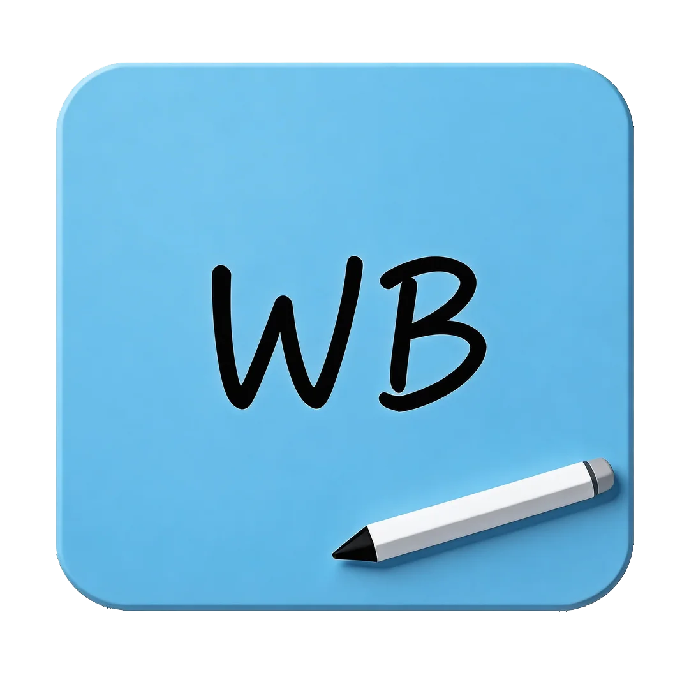
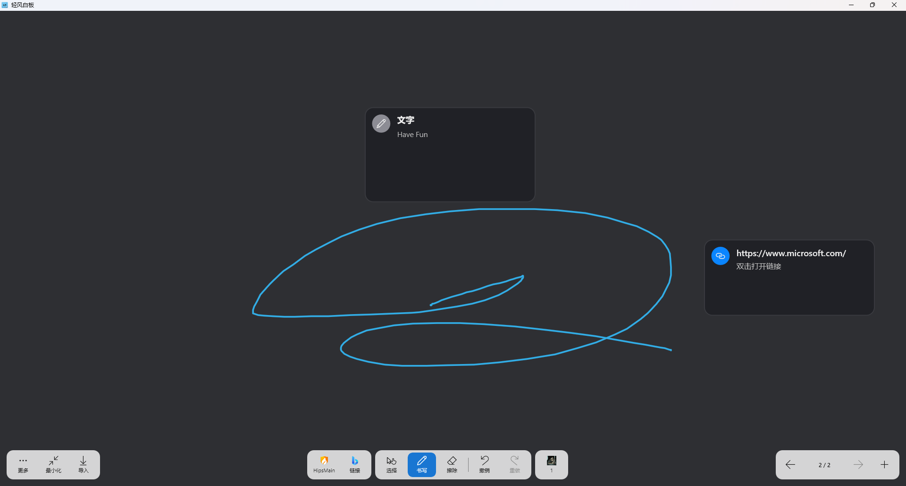
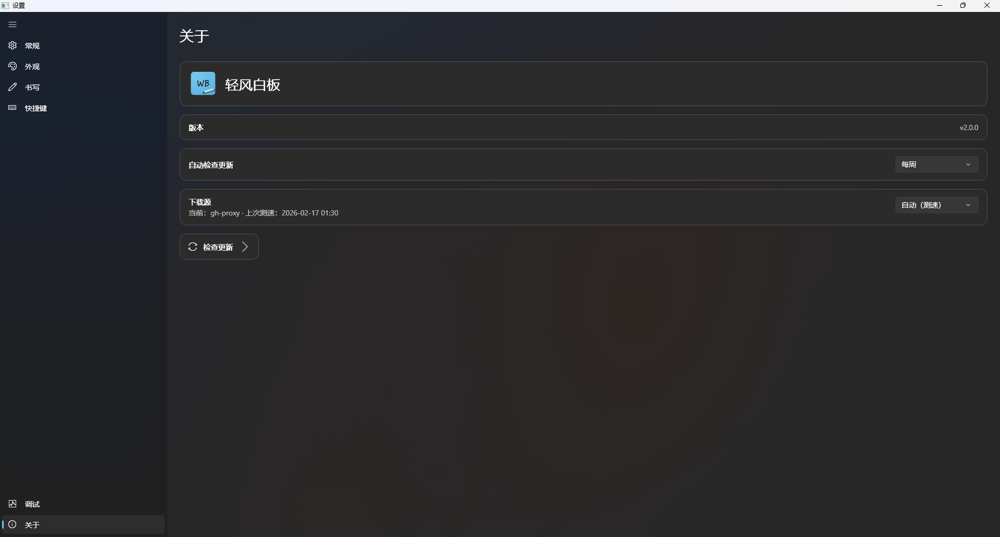

[简体中文](./README.md) | [English](./README_EN.md)

  

  <h2><strong>轻风白板</strong></h2>

  开源、简洁、易上手的电子白板

---

   [![zread](https://img.shields.io/badge/Ask_Zread-_.svg?style=flat&color=00b0aa&labelColor=000000&logo=data%3Aimage%2Fsvg%2Bxml%3Bbase64%2CPHN2ZyB3aWR0aD0iMTYiIGhlaWdodD0iMTYiIHZpZXdCb3g9IjAgMCAxNiAxNiIgZmlsbD0ibm9uZSIgeG1sbnM9Imh0dHA6Ly93d3cudzMub3JnLzIwMDAvc3ZnIj4KPHBhdGggZD0iTTQuOTYxNTYgMS42MDAxSDIuMjQxNTZDMS44ODgxIDEuNjAwMSAxLjYwMTU2IDEuODg2NjQgMS42MDE1NiAyLjI0MDFWNC45NjAxQzEuNjAxNTYgNS4zMTM1NiAxLjg4ODEgNS42MDAxIDIuMjQxNTYgNS42MDAxSDQuOTYxNTZDNS4zMTUwMiA1LjYwMDEgNS42MDE1NiA1LjMxMzU2IDUuNjAxNTYgNC45NjAxVjIuMjQwMUM1LjYwMTU2IDEuODg2NjQgNS4zMTUwMiAxLjYwMDEgNC45NjE1NiAxLjYwMDFaIiBmaWxsPSIjZmZmIi8%2BCjxwYXRoIGQ9Ik00Ljk2MTU2IDEwLjM5OTlIMi4yNDE1NkMxLjg4ODEgMTAuMzk5OSAxLjYwMTU2IDEwLjY4NjQgMS42MDE1NiAxMS4wMzk5VjEzLjc1OTlDMS42MDE1NiAxNC4xMTM0IDEuODg4MSAxNC4zOTk5IDIuMjQxNTYgMTQuMzk5OUg0Ljk2MTU2QzUuMzE1MDIgMTQuMzk5OSA1LjYwMTU2IDE0LjExMzQgNS42MDE1NiAxMy43NTk5VjExLjAzOTlDNS42MDE1NiAxMC42ODY0IDUuMzE1MDIgMTAuMzk5OSA0Ljk2MTU2IDEwLjM5OTlaIiBmaWxsPSIjZmZmIi8%2BCjxwYXRoIGQ9Ik0xMy43NTg0IDEuNjAwMUgxMS4wMzg0QzEwLjY4NSAxLjYwMDEgMTAuMzk4NCAxLjg4NjY0IDEwLjM5ODQgMi4yNDAxVjQuOTYwMUMxMC4zOTg0IDUuMzEzNTYgMTAuNjg1IDUuNjAwMSAxMS4wMzg0IDUuNjAwMUgxMy43NTg0QzE0LjExMTkgNS42MDAxIDE0LjM5ODQgNS4zMTM1NiAxNC4zOTg0IDQuOTYwMVYyLjI0MDFDMTQuMzk4NCAxLjg4NjY0IDE0LjExMTkgMS42MDAxIDEzLjc1ODQgMS42MDAxWiIgZmlsbD0iI2ZmZiIvPgo8cGF0aCBkPSJNNCAxMkwxMiA0TDQgMTJaIiBmaWxsPSIjZmZmIi8%2BCjxwYXRoIGQ9Ik00IDEyTDEyIDQiIHN0cm9rZT0iI2ZmZiIgc3Ryb2tlLXdpZHRoPSIxLjUiIHN0cm9rZS1saW5lY2FwPSJyb3VuZCIvPgo8L3N2Zz4K&logoColor=ffffff)](https://zread.ai/Jerry-Z07/WindBoard) 

> [!NOTE]
> ~~本项目处于活跃开发阶段，API 和功能可能会频繁变更。~~ 生产环境使用请谨慎。  
> 由于学业繁重，开发者将无法及时处理 Issue 和 PR，开发进程也会放缓

> [!IMPORTANT]
> 本项目完全使用 AI 开发，如对此无法接受请寻找其它软件进行替代。  
> 软件尚未成熟，如果将其用于要求较高的生产环境（如课堂等），请保证能够承担由于软件问题导致的一些突发状况（如书写手感异常、崩溃等）的责任。

## 软件截图

点击查看截图

## 功能

- 基础书写（粗细、颜色、擦除、撤销/恢复等）
- 导出/导入功能
- 多页面管理
- 无界书写
- 多语言支持
- ...（开发中）

## 特点

- 高度自定义：可选附加内容到 Dock 栏
- 伪装：使软件外显为自定义的图标/进程名

## 技术栈

- UI：WinUI 3（Windows App SDK）
- 渲染：DirectX（Vortice.Direct2D1 / Vortice.Direct3D11）
- 运行时：.NET 10（`net10.0-windows`）
- 序列化：System.Text.Json + 自定义工作区格式（WBIX）
- 测试：xUnit（`WindBoard.Tests`）
- 打包：Inno Setup（`installer/`）

## 快速开始

可跳转 [Releases](https://github.com/Jerry-Z07/WindBoard/releases/latest) 获取软件。

## 贡献

我们欢迎 Pull Request 和 Issue，也非常感谢你对本项目的支持！

### 开发环境要求

- .NET 10.0 SDK
- Windows 10/11（最低支持 `10.0.19041.0`）
- 开发工具：
  - Visual Studio 2026 或更高版本
  - JetBrains Rider 2025.3.1 或更高版本
  - Visual Studio Code

### 构建与测试

- 构建：`dotnet build WindBoard.slnx -c Release`
- 测试：`dotnet test WindBoard.slnx`

### 参与翻译

请参考 [本地化约定](./docs/dev/guides/localization.zh-CN.md) 文档

### 氛围编程（Vibe Coding）相关

- 项目目前已配置[AGENTS.md](AGENTS.md)
- 开发中使用过的工具：
  - MCP

  | **MCP**  | **介绍**     | **使用教程**                                                            |
  |----------|------------|-----------------------------------------------------------------------|
  | ace-tool | 代码库检索工具    | <https://linux.do/t/topic/1360514>                                    |
  | context7 | 查询开发文档     | <https://github.com/upstash/context7#installation>                    |
  | fetch    | 获取网页内容     | <https://github.com/modelcontextprotocol/servers/tree/main/src/fetch> |
  | github   | 辅助操作Github | <https://github.com/github/github-mcp-server>                         |

  - 其他

  | **工具名称**                                               | **推荐理由**     | **备注** |
  |--------------------------------------------------------|--------------|--------|
  | [qlty](https://docs.qlty.sh/cli/quickstart)            | 代码审查与分析 CLI  | 开源，项目已init     |
  | [MCP Router](https://github.com/mcp-router/mcp-router) | 简化 MCP 工具的配置 | 开源     |

## Todo / 仍需完善的部分

- [ ] UI统一和美化
- [ ] 更优化的笔迹平滑算法
- [ ] 触摸面积识别算法（用于掌擦逻辑）
- [ ] 软件整体性能优化
- [ ] 完善文档

## 生态

为保存和还原笔迹状态，我们设计了一个私有格式 `.wbix`  
格式介绍见 [WBIX.md](./docs/dev/guides/wbix.zh-CN.md)

## 许可证

Apache License 2.0
